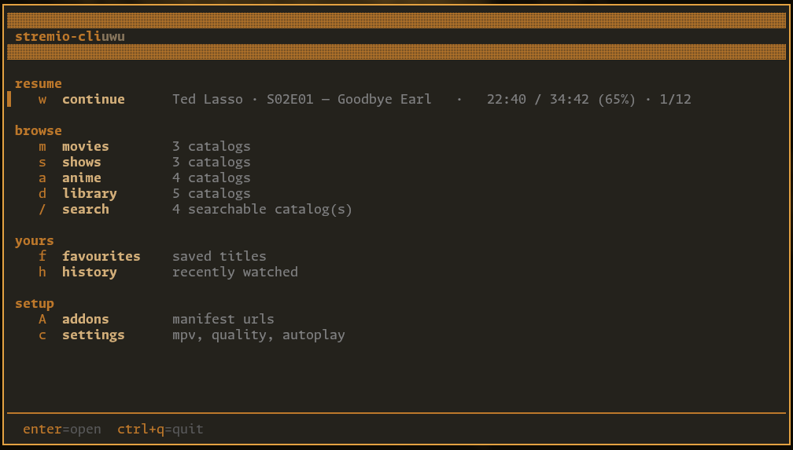

# stremio-cliuwu

A terminal Stremio client. Browse your addons' catalogs, pick a stream, and it
plays in mpv. Keeps track of what you've watched and where you got to.

[](https://o3o.lol/PfG3bI.mp4)

CLICK SCREENSHOT FOR VIDEO DEMO

## Install

Grab a binary from [releases](https://github.com/ilovealienz/stremio-cliuwu/releases),
or build it yourself:

```
git clone https://github.com/ilovealienz/stremio-cliuwu
cd stremio-cliuwu
go build -o stremio-cliuwu .
```

You'll need [mpv](https://mpv.io) installed. That's the only requirement.

## First run

Two things to set up, both take a minute.

### 1. Point it at mpv

Open **settings** (press `c` from the main menu) and check the **mpv path**.

Most of the time it'll have found mpv already and you can ignore this. If it
says `—` or you get "mpv not found", set it manually:

- **Linux / macOS** — usually just leave it blank, `mpv` is on your PATH
- **Windows** — paste the full path to the exe, something like
  `C:\Users\YourName\mpv\mpv.exe` or `C:\Program Files\mpv\mpv.exe`

### 2. Add your addons

Cinemeta and Kitsu come pre-installed so you can browse straight away, but you
need a **stream addon** (Torrentio, etc) before anything will actually play.

To get an addon's URL:

1. Go to [web.stremio.com/#/addons](https://web.stremio.com/#/addons)
2. Find the addon you want, hit **Share**
3. Copy the link it gives you

Then in stremio-cliuwu:

1. Press `A` (shift+A) for the **addons** screen
2. Press `a` to add
3. Paste it — `ctrl+shift+v` on Linux, `ctrl+v` on Windows
4. Enter

That's it. Press `r` if you want to re-check that they all loaded.

Addon order matters — stream results are grouped in the order listed, so put
your favourite on top with `J` / `K`.

> Addon URLs often have your debrid API key baked into them, so treat
> `addons.json` like a password file. The app blurs the key when it shows a URL
> and writes the file `0600`.

## Getting around

Arrow keys and enter get you everywhere. The footer always shows what the
current screen can do.

| | |
|---|---|
| arrow keys | move up and down, left and right to page |
| `enter` | open |
| `b` or `esc` | back |
| `/` | filter the list |
| `0-9` | jump straight to a numbered stream |
| `i` | show info for whatever's highlighted |
| `tab` | switch provider / category |
| `X` | stop mpv |
| `ctrl+q` | quit |

If you're a vim person, `j` `k` and `ctrl+u` `ctrl+d` work too.

From the main menu you can jump straight to things: `m` movies, `s` shows,
`a` anime, `d` library, `/` search, `f` favourites, `h` history, `D` downloads,
`A` addons, `c` settings, `w` continue watching.

On an episode list, `w` marks one watched and `W` does the whole season. On a
catalog, `g` picks a genre. On a stream, `D` downloads it.

Pause and seek aren't bound — do that in the mpv window, it's right there.

## From the command line

```
stremio-cliuwu                     the main menu
stremio-cliuwu chuunibyou          search for it
stremio-cliuwu -a chuunibyou       search anime only
stremio-cliuwu -sf -a chuunibyou   ...and open the first result
stremio-cliuwu -m                  browse movies
```

`-m` movies, `-t` shows, `-a` anime, `-s` search, `-sf` search and open the
first result. `--help` for the rest.

## Heads up

I daily drive this on Linux, so that's what gets the most use. Windows works
fine as far as I can tell, it just doesn't get tested as much — if you hit
something odd there, [open an issue](https://github.com/ilovealienz/stremio-cliuwu/issues)
and I'll take a look.

Worth knowing on Windows: use Windows Terminal rather than the old `cmd`
console, otherwise some of the characters come out as boxes.

And one that isn't a bug — debrid links expire after a while. If a stream won't
open, press `R` on the stream list to fetch fresh ones.

## Config

Lives in `~/.config/stremio-cliuwu/` (or `%APPDATA%\stremio-cliuwu\`):

| | |
|---|---|
| `config.json` | mpv path, quality, downloads, appearance |
| `addons.json` | your addon URLs |
| `favourites.json` | |
| `history.json` | positions and watched state |

Everything in `config.json` is editable from the settings screen, so you
shouldn't need to touch these by hand.

## Licence

MIT
